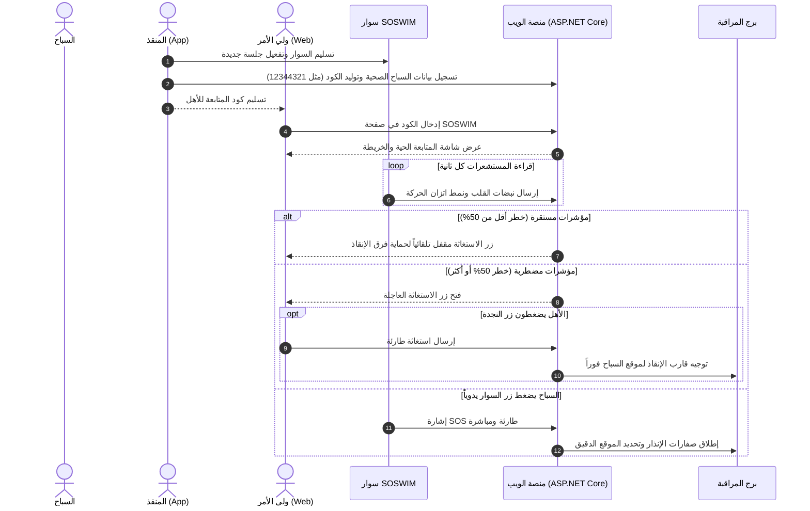
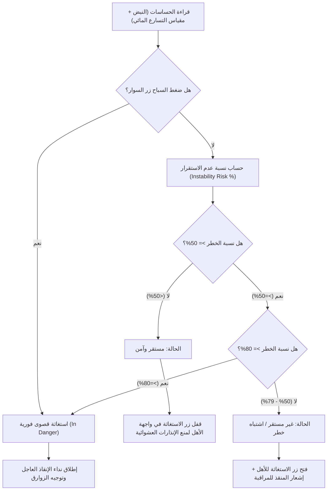

# SOSWIM Workflows & Safety Logic

## 1. Swimmer Session Lifecycle & Parent Access

```mermaid
sequenceDiagram
    autonumber
    actor Swimmer as السباح
    actor Lifeguard as المنقذ (App)
    actor Parent as ولي الأمر (Web)
    participant Device as سوار SOSWIM
    participant Platform as منصة الويب (ASP.NET Core)
    participant Tower as برج المراقبة

    Lifeguard->>Device: تسليم السوار وتفعيل جلسة جديدة
    Lifeguard->>Platform: تسجيل بيانات السباح الصحية وتوليد الكود (مثل 12344321)
    Lifeguard-->>Parent: تسليم كود المتابعة للأهل
    Parent->>Platform: إدخال الكود في صفحة SOSWIM
    Platform-->>Parent: عرض شاشة المتابعة الحية والخريطة

    loop قراءة المستشعرات كل ثانية
        Device->>Platform: إرسال نبضات القلب ونمط اتزان الحركة
    end

    alt مؤشرات مستقرة (خطر أقل من 50%)
        Platform-->>Parent: زر الاستغاثة مقفل تلقائياً لحماية فرق الإنقاذ
    else مؤشرات مضطربة (خطر 50% أو أكثر)
        Platform-->>Parent: فتح زر الاستغاثة العاجلة
        opt الأهل يضغطون زر النجدة
            Parent->>Platform: إرسال استغاثة طارئة
            Platform->>Tower: توجيه قارب الإنقاذ لموقع السباح فوراً
        end
    else السباح يضغط زر السوار يدوياً
        Device->>Platform: إشارة SOS طارئة ومباشرة
        Platform->>Tower: إطلاق صفارات الإنذار وتحديد الموقع الدقيق
    end
```

## 2. The 50% Instability Decision Flow

```mermaid
flowchart TD
    A["قراءة الحساسات (النبض + مقياس التسارع المائي)"] --> B{"هل ضغط السباح زر السوار؟"}
    B -- نعم --> C["استغاثة قصوى فورية (In Danger)"]
    B -- لا --> D["حساب نسبة عدم الاستقرار (Instability Risk %)"]
    
    D --> E{"هل نسبة الخطر >= 50%؟"}
    E -- لا (<50%) --> F["الحالة: مستقر وآمن"]
    F --> G["قفل زر الاستغاثة في واجهة الأهل لمنع الإنذارات العشوائية"]

    E -- نعم (>=50%) --> H{"هل نسبة الخطر >= 80%؟"}
    H -- لا (50% - 79%) --> I["الحالة: غير مستقر / اشتباه خطر"]
    I --> J["فتح زر الاستغاثة للأهل + إشعار المنقذ للمراقبة"]
    
    H -- نعم (>=80%) --> C
    C --> K["إطلاق نداء الإنقاذ العاجل وتوجيه الزوارق"]
```
